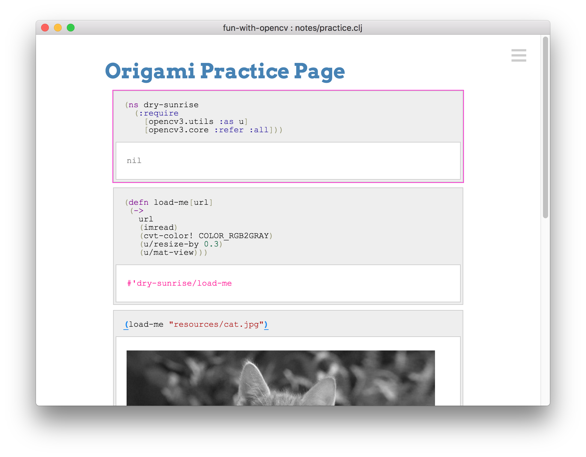
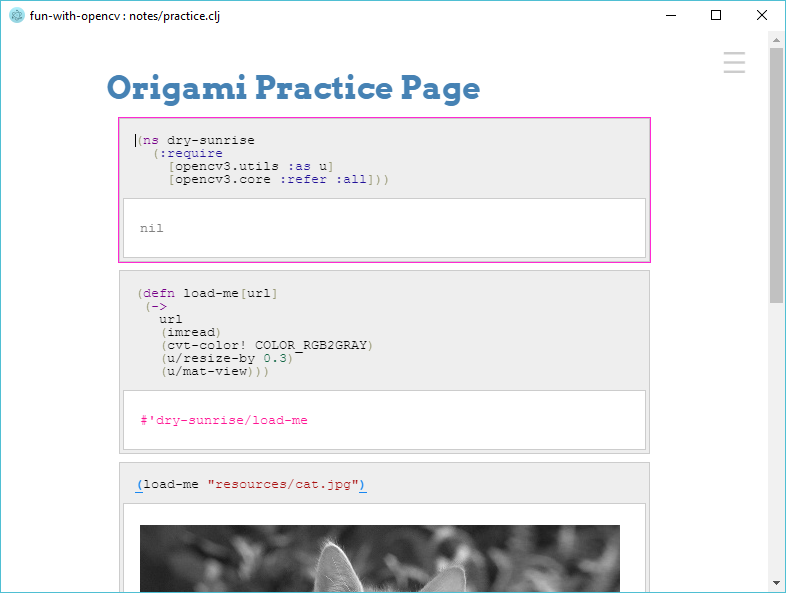
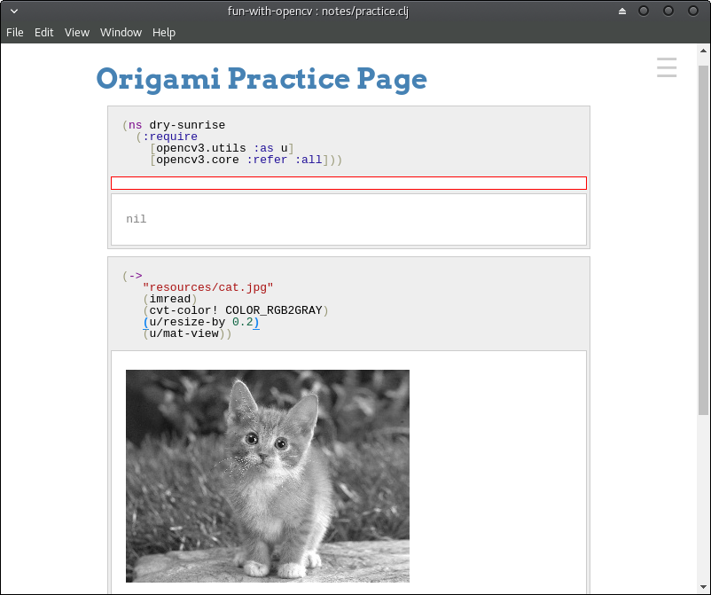

# dev mode
```
npm install
npm start
```

# package mode

```
npm install electron-packager -g
electron-packager . origamiapp

```
# Screenshot

### macos



### windows



### linux (manjaro)



Copyright - Nicolas Modrzyk 2017